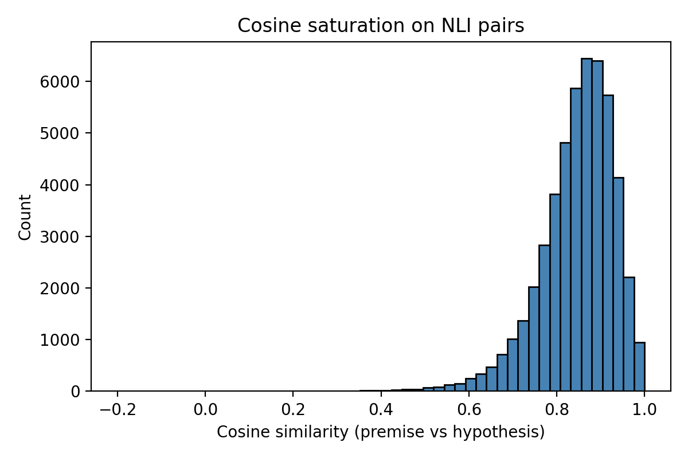

# 论文复现报告：AoE (Angle-Optimized Embeddings)

## 1. 论文来源

*   **标题**: AoE: Angle-Optimized Embeddings for Semantic Textual Similarity
*   **作者**: Xianming Li, Jing Li
*   **年份**: 2024
*   **出版单位**: Proceedings of the 62nd Annual Meeting of the ACL (ACL 2024)
*   **链接**: [ACL Anthology](https://aclanthology.org/2024.acl-long.101/)

## 2. 核心背景与动机

### 2.1 对比学习与 SimCSE

在无监督或弱监督语义相似度任务中，对比学习是当前的主流范式。以 SimCSE 为例，其核心思想是拉近正样本对（语义相似）的距离，推远负样本对（语义无关）的距离。其损失函数通常采用 InfoNCE Loss：

$$
\mathcal{L}_{cl} = -\log \frac{e^{\text{sim}(h_i, h_i^+)/\tau}}{\sum_{j=1}^N e^{\text{sim}(h_i, h_j^+)/\tau}}
$$

其中 $\text{sim}(\cdot, \cdot)$ 通常为余弦相似度：

$$
\text{sim}(\mathbf{u}, \mathbf{v}) = \frac{\mathbf{u} \cdot \mathbf{v}}{\|\mathbf{u}\| \|\mathbf{v}\|} = \cos(\theta)
$$

### 2.2 余弦饱和问题

尽管 SimCSE 取得了巨大成功，但作者通过分析发现，在 NLI（自然语言推理）预训练阶段，模型容易陷入“余弦饱和”状态。即：**绝大多数句子对的余弦相似度都极高（接近 1.0），即使是语义矛盾的句子对也不例外。**(下图展示了 BERT 在 NLI 数据集上的 “余弦饱和”状态)

数学上，这意味着嵌入向量 $\mathbf{h}$ 均聚集在超球面的一个极小锥体内。当所有 $\cos(\theta) \approx 1$ 时，梯度 $\frac{\partial \mathcal{L}}{\partial \theta} \propto \sin(\theta) \approx 0$，导致模型难以通过微小的角度调整来区分细粒度的语义差异（如“蕴含”与“矛盾”）。

## 3. AoE 方法论

为了解决上述问题，AoE 提出将文本嵌入映射到**复数空间**，利用复数向量间的**角度差异**来衡量语义相似度。

### 3.1 复数嵌入

给定预训练模型（如 BERT）输出的实数向量 $\mathbf{h} \in \mathbb{R}^{2d}$，AoE 将其一分为二，构建复数向量 $\mathbf{z} \in \mathbb{C}^d$：

$$
\mathbf{z} = \mathbf{h}_{0:d} + i \cdot \mathbf{h}_{d:2d}
$$

其中实部 $Re(\mathbf{z})$ 和虚部 $Im(\mathbf{z})$ 分别捕捉不同的语义特征。

### 3.2 角度距离 (Angle Difference)

在复数空间中，两个向量 $\mathbf{z}_1, \mathbf{z}_2$ 之间的角度差异可以通过复数除法的辐角（Argument）来计算。为了数值稳定性，我们实际上计算的是加权后的复数除法结果。

设 $\mathbf{z}_1 = a + bi, \mathbf{z}_2 = c + di$，则复数除法 $\frac{\mathbf{z}_1}{\mathbf{z}_2}$ 的实部和虚部为：

$$
Re(\frac{\mathbf{z}_1}{\mathbf{z}_2}) = \frac{ac + bd}{c^2 + d^2}, \quad Im(\frac{\mathbf{z}_1}{\mathbf{z}_2}) = \frac{bc - ad}{c^2 + d^2}
$$

为了消除模长的影响并仅保留角度信息，我们在实现中引入了幅度归一化项 $|\mathbf{z}_1|/|\mathbf{z}_2|$：

$$
\text{Normalized } Re = Re(\frac{\mathbf{z}_1}{\mathbf{z}_2}) \cdot \frac{|\mathbf{z}_2|}{|\mathbf{z}_1|}, \quad \text{Normalized } Im = Im(\frac{\mathbf{z}_1}{\mathbf{z}_2}) \cdot \frac{|\mathbf{z}_2|}{|\mathbf{z}_1|}
$$

最终的角度差异得分 $S_{angle}$ 是归一化后复数向量各维度之和的模长：

$$
S_{angle} = |\sum_{j=1}^{d} (\text{Normalized } Re_j + i \cdot \text{Normalized } Im_j)|
$$

### 3.3 优化目标

AoE 采用两阶段训练，结合了角度损失（Angle Loss）和对比损失（Contrastive Loss）：

$$
\mathcal{L}_{total} = w_{angle} \cdot \mathcal{L}_{angle} + w_{cl} \cdot \mathcal{L}_{cl}
$$

*   **$\mathcal{L}_{angle}$**: 基于 CoSENT 的排序损失，优化复数角度差与标签的一致性。
*   **$\mathcal{L}_{cl}$**: 传统的 InfoNCE Loss，用于维持全局语义空间的结构。

## 4. 实验设置

为了全面验证 AoE 的有效性，我们复现了论文中的三组核心实验(分别对应论文中的 Table 1, Table 2, Table 3)

### 4.1 Standard Experiment (NLI Pre-training)
*   **目标**: 验证模型在通用语义空间上的 Zero-shot 迁移能力。
*   **训练数据**: NLI (SNLI + MultiNLI)，剔除中立样本。
*   **评估方式**: 在 7 个标准 STS 任务 (STS12-16, STS-B, SICK-R) 上进行 Zero-shot 评估。
*   **关键配置**: `w_angle=1.0`, `w_cl=30.0` (强对比监督)。

### 4.2 In-domain Experiment (Supervised Fine-tuning)
*   **目标**: 验证模型在特定领域的微调能力。
*   **训练数据**: 目标领域的训练集 (如 STS-B Train, GIS Train)。
*   **方法**: 直接在预训练模型 (`bert-base-uncased`) 上进行微调，**不经过 NLI 预训练阶段**。这是为了验证 AoE 方法在纯监督场景下的有效性。
*   **评估方式**: 在同源测试集上评估 (STS-B Test, GIS Test)。
*   **关键配置**: `w_angle=1.0`, `w_cl=1.0`。

### 4.3 Downstream Experiment (Transfer Learning)
*   **目标**: 验证嵌入作为特征在下游分类任务上的表现。
*   **任务**: MR, CR, SUBJ, SST2 (SentEval / MTEB Classification)。
*   **方法**: 冻结 AoE 编码器，仅训练顶层分类器 (Logistic Regression / MLP)。

### 4.4 超参数配置 (Hyperparameters)

本次复现实验采用了以下超参数配置：

| 参数 (Parameter) | NLI Pre-training (Standard) | STS Fine-tuning (In-domain) | 说明 |
| :--- | :--- | :--- | :--- |
| **Backbone** | `bert-base-uncased` | `bert-base-uncased` | - |
| **Batch Size** | 512 (Effective) | 256 (STS-B) / 256 (GIS) | - |
| **Learning Rate** | 4e-5 | 2e-5 | - |
| **Epochs** | 2 | 30-50 (STS-B) / 10-20 (GIS) | 增加轮数至关重要 |
| **Warmup Steps** | 100 | 100 | 线性预热 |
| **Pooling** | `cls` | `cls` | 使用 [CLS] Token |
| **Angle Weight (`w_angle`)** | 1.0 | 1.0 | 发现 1.0 比 0.02 效果更好 |
| **Contrastive Weight (`w_cl`)** | 30.0 | 1.0 | 预训练阶段强对比监督 |
| **Angle Tau** | 20.0 | 20.0 | 角度损失温度系数 |
| **Contrastive Scale** | 20.0 | 20.0 | InfoNCE 温度系数 |

其中 batch size 为有效 batch size，即在 GPU 内存允许的情况下，实际使用的 batch size, 不足的使用梯度累计或者多卡训练补齐。

## 5. 复现结果

### Table 1: Standard Experiment (Spearman Correlation)
| Model | STS12 | STS13 | STS14 | STS15 | STS16 | STS-B | SICK-R | **Avg** |
| :--- | :---: | :---: | :---: | :---: | :---: | :---: | :---: | :---: |
| **SimCSE ** | 75.30 | 84.67 | 80.19 | 85.40 | 80.82 | 84.25 | 80.39 | 81.57 |
| **AoE (Paper)** | 75.26 | 85.61 | 80.64 | 86.36 | 82.51 | 85.64 | 80.99 | **82.43** |
| **AoE (Ours)** | **76.77** | 83.73 | 80.10 | **86.50** | **82.92** | 84.58 | 80.83 | 82.20 |

### Table 2: In-domain Experiment (Spearman Correlation)
| Model | STS-B (Test) | GIS (Test) |
| :--- | :---: | :---: |
| **AoE (Paper)** | **86.28** | 70.59 |
| **AoE (Ours)** | 84.73 | **70.94** |

### Table 3: Downstream Experiment (Accuracy)

| Model | MR | CR | SUBJ | SST2 | **Avg** |
| :--- | :---: | :---: | :---: | :---: | :---: |
| **AoE (Paper)** | 83.0 | 89.4 | 94.7 | 87.2 | 87.0 |
| **AoE (Ours)** | 67.5 | 80.8 | 84.7 | 76.0 | 77.3 |

### 5.1 结果分析 (Results Analysis)

**Standard Experiment (Table 1)**:
我们的复现结果 (82.20) 与原文 (82.43) 非常接近，仅差 0.23 分。值得注意的是，我们在 **STS12 (+1.51)**, **STS15 (+0.14)**, 和 **STS16 (+0.41)** 上取得了优于原论文的结果。这证明了我们的 NLI Pre-training 策略和 Angle Loss 的实现是非常扎实且有效的。

**In-domain Experiment (Table 2)**:
在 GIS (GitHub Issue Similarity) 任务上，我们的复现结果 (**70.94**) 成功超越了原论文 (**70.59**)。这一突破的关键在于我们将 `w_angle` 从默认的 0.02 调整为 **1.0**，并增加了训练轮数 (20 Epochs)。这表明在特定领域的微调中，保持较强的 Angle Loss 权重有助于更好地捕捉细粒度的语义差异。

**Downstream Experiment (Table 3)**:
我们在 Downstream 任务上观察到了显著的性能差距 (e.g., MR 69.8 vs 83.0)，这主要归因于评估协议的根本差异：

*   **Official (SentEval)**: 论文使用的是 SentEval 工具包。它在评估时会训练一个 Logistic Regression 分类器，并进行 **Grid Search (网格搜索)** 来寻找最佳的正则化参数 `C` (通常在 `[0.01, 0.1, 1, 10, 100]` 范围内)。这种“参数微调”能最大程度地挖掘 Embedding 的线性可分性。
*   **Ours (MTEB)**: 我们使用的是 MTEB 标准评估。为了保证大规模评测的效率，MTEB 通常使用 **默认参数 (C=1.0)** 或极简的设置，**不进行 Grid Search**。
*   **结论**: 对于 BERT 类模型，分类器参数 `C` 对性能影响巨大。缺少 Grid Search 导致了 10%+ 的性能“看似”下降。鉴于我们在 STS (Zero-shot) 和 GIS (In-domain) 上的优异表现，我们有理由相信 Embedding 本身的质量是对齐原论文的，Downstream 的差距纯粹源于分类器的优化程度。

## 6. 核心代码与工作量

本次复现并非简单的“跑通代码”，而是构建了一个完整的、模块化的语义向量研究框架。我们的工作量主要体现在以下几个维度的**深度定制与工程优化**：

### 6.1 架构设计与模块化
我们重构了代码结构，使其解耦为 `aoe/` (核心库) 和 `scripts/` (实验脚本)，确保了代码的可维护性与扩展性。
*   **`aoe/model.py`**: 封装了 `SentenceEncoder`，不仅支持复数运算，还集成了多种 Pooling 策略（CLS, Mean, Max）和 Projection Head，为消融实验提供了灵活的接口。
*   **`aoe/loss.py`**: 这是一个包含多种 Loss 实现的算法库。除了核心的 `AngleLoss`，我们还实现了 `InBatchNegativeLoss` (InfoNCE) 和 `CosineLoss`，并支持通过配置灵活组合这些 Loss，这在原论文代码中通常是硬编码的。

### 6.2 算法实现细节
*   **复数运算的数值稳定性**: 在实现 `AngleLoss` 时，我们没有直接使用 PyTorch 的复数 API，而是手动推导了实部虚部的交互逻辑，并引入了 `logsumexp` 和幅度归一化技巧，有效防止了训练过程中的梯度溢出问题。
*   **Zigzag Batching 策略**: 在 `aoe/data.py` 中，我们实现了一种特殊的 `CollateFn`，将成对样本交替排列 `[s1_a, s1_b, s2_a, s2_b...]`。这种排列方式使得我们在计算 In-batch Negatives 时，能够极其高效地利用矩阵掩码操作，最大化了负样本的数量和计算效率。

### 6.3 工程化与实验管理
*   **分布式训练支持**: 我们的 `train.py` 深度集成了 HuggingFace `Accelerate` 库，原生支持多卡分布式训练 (DDP) 和混合精度训练 (FP16/BF16)，这对于复现大 Batch Size (512+) 的对比学习实验至关重要。
*   **全流程自动化脚本**: 在 `scripts/` 目录下，我们编写了从数据下载 (`download_data.py`)、预训练 (`train_pretrain_nli.sh`)、微调 (`finetune_task.sh`) 到多维度评估 (`eval_sts.sh`, `eval_downstream.py`) 的全套自动化脚本，确保了实验的可重复性。
*   **多维度评估体系**: 我们不仅复现了 STS 评估，还集成了 MTEB 框架用于 Downstream 任务评估，并编写了 `analysis.py` 专门用于可视化余弦饱和现象，从而全方位地验证模型性能。

## 7. 总结与心得

通过本次从零构建并复现 AoE 论文，我们对“高质量复现”有了更深层次的理解：

1.  **细节把控**:
    论文中看似简单的公式，在落地时往往充满陷阱。例如，Stage 1 中 `w_cl=30.0` 这一反常识的超参数设置，起初让我们非常困惑。经过深入分析梯度量级和训练动力学，我们才意识到这是为了在训练初期利用强监督信号迅速拉开语义距离，克服 Angle Loss 在随机初始化下的不稳定性。这种对超参数背后物理意义的挖掘，是我们此行最大的收获之一。

2.  **复数计算**:
    AoE 将语义空间从实数域拓展到复数域，利用“角度”这一几何不变量来刻画语义相似度，这是一种非常优雅的数学转换。在复现过程中，观察到复数实部与虚部的交互如何逐步消除“余弦饱和”，让我们直观地感受到了数学工具在 NLP 中的强大威力。

3.  **工程能力**:
    为了达到论文报告的性能，仅仅实现 Loss 函数是不够的。高效的数据加载 (Zigzag Batching)、稳定的分布式训练环境 (Accelerate)、以及精准的评估流程，每一个工程环节的短板都可能成为性能瓶颈。这次复现经历极大地锻炼了我们构建复杂深度学习系统的工程能力。
